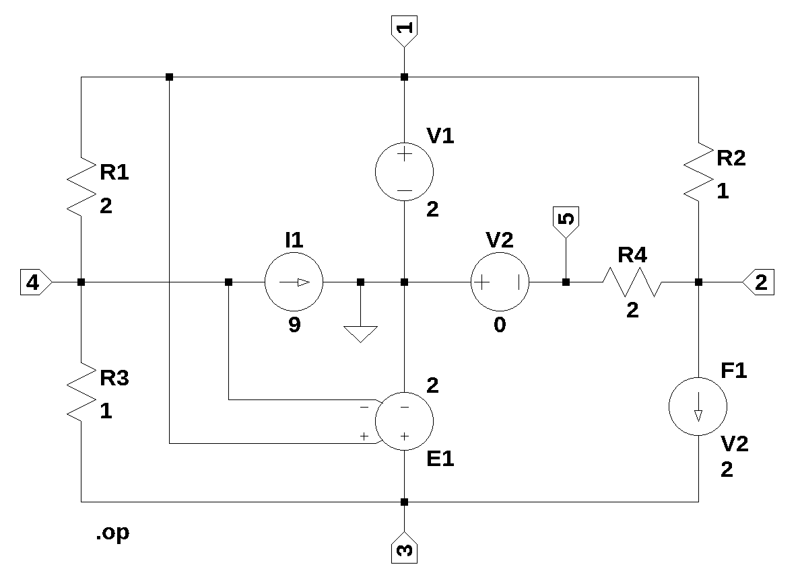

# test circuit 1  
number of branches: 9  
number of nodes: 5  
number of unknown currents: 4  
number of RLC (passive components): 4  
number of independent voltage sources: 2  
number of independent current sources: 1  
number of E - VCVS: 1  
number of F - CCCS: 1  

 

