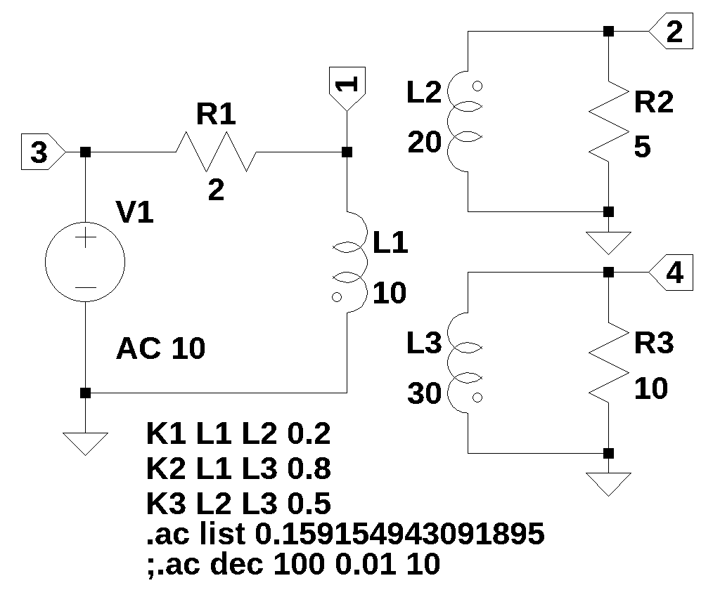

# test circuit 11
  

The net list below fails to generate the correct equations. If the line 'V1 3 0 AC 10' is moved to the first line of the net list, correct equations are generated. It should not matter where in the net list the voltage source appears.  

~~~
* test_11.asc
L1 1 0 10 Rser=0
L2 0 2 20 Rser=0
L3 4 0 30 Rser=0
R2 2 0 5
R3 4 0 10
R1 1 3 2
V1 3 0 AC 10
K1 L1 L2 0.2
K2 L1 L3 0.8
K3 L2 L3 0.5
* ;.ac list 0.159154943091895
.ac dec 100 0.01 10
.backanno
.end
~~~

 

