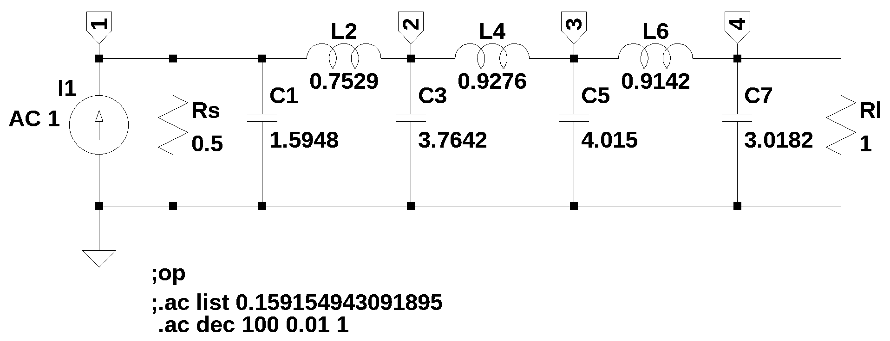

# test circuit 12
 

This test circuit is a 7th order low pass filter, Chebyshev response, 0.1 dB of ripple from Anatol I. Zverev, *Handbook of Filter Synthesis*, John Wiley & Sons, 1967.

number of lines in netlist: 10  
number of branches: 10  
number of nodes: 4  
number of unknown currents: 6  
number of RLC (passive components): 18  
number of inductors: 6  
number of independent voltage sources: 0  
number of independent current sources: 2  
number of op amps: 0  
number of E - VCVS: 0  
number of G - VCCS: 0  
number of F - CCCS: 0  
number of H - CCVS: 0  
number of K - Coupled inductors: 0  

