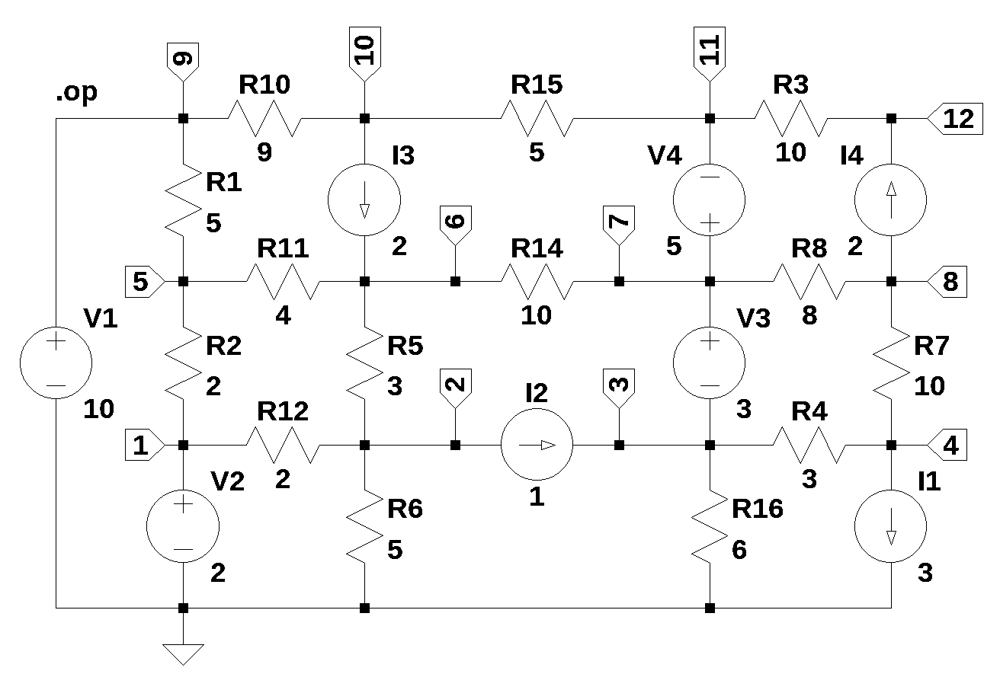

# test circuit 2

number of branches: 22  
number of nodes: 12  
number of unknown currents: 4  
number of RLC (passive components): 14  
number of independent voltage sources: 4  
number of independent current sources: 4  

 
