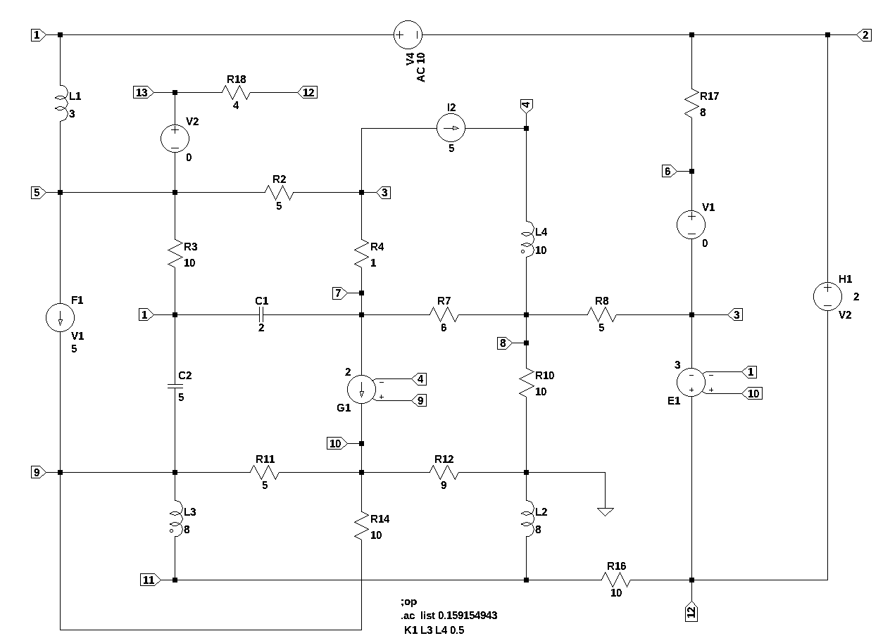

# Test circuit 6
number of lines in netlist: 27  
number of branches: 26  
number of nodes: 13  
number of unknown currents: 10  
number of RLC (passive components): 18  
number of inductors: 4  
number of independent voltage sources: 3  
number of independent current sources: 1  
number of op amps: 0  
number of E - VCVS: 1  
number of G - VCCS: 1  
number of F - CCCS: 1  
number of H - CCVS: 1  
number of K - Coupled inductors: 1  

  

