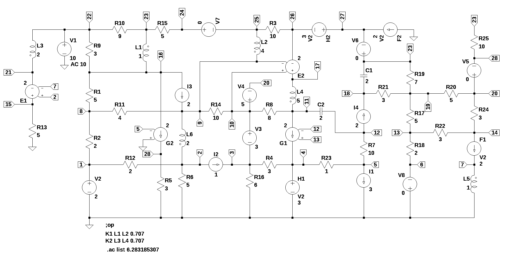

# test circuit 7
number of lines in netlist: 55  
number of branches: 53  
number of nodes: 28  
number of unknown currents: 20  
number of RLC (passive components): 33  
number of inductors: 6  
number of independent voltage sources: 8  
number of independent current sources: 4  
number of op amps: 0  
number of E - VCVS: 2  
number of G - VCCS: 2  
number of F - CCCS: 2  
number of H - CCVS: 2  
number of K - Coupled inductors: 2  

  

