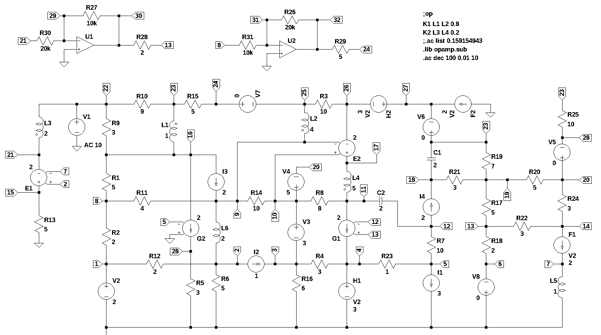

# test circuit 8
Large circuit containing at least two of each element type.  

number of lines in netlist: 63  
number of branches: 59  
number of nodes: 32  
number of unknown currents: 22  
number of RLC (passive components): 39  
number of inductors: 6  
number of independent voltage sources: 8  
number of independent current sources: 4  
number of op amps: 2  
number of E - VCVS: 2  
number of G - VCCS: 2  
number of F - CCCS: 2  
number of H - CCVS: 2  
number of K - Coupled inductors: 2  

   
