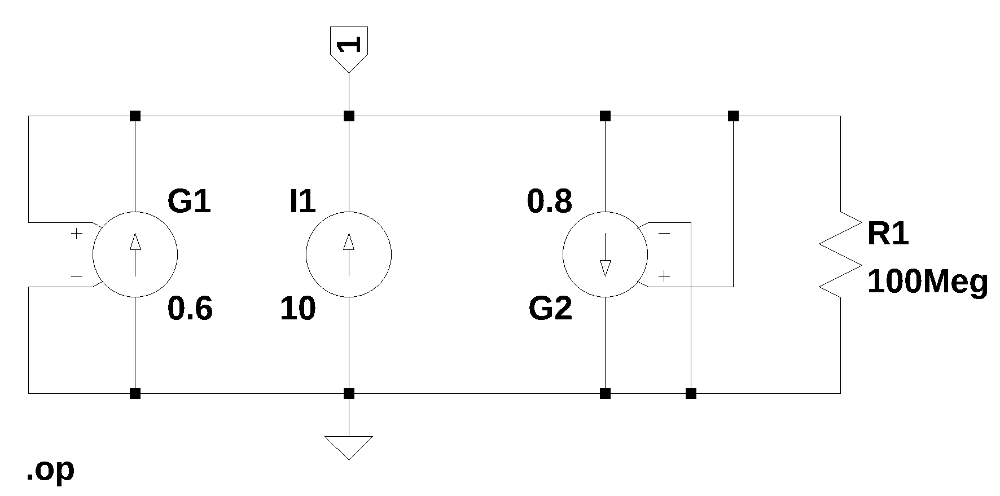

# test circuit 9
Current sources only dependent and independent  

number of lines in netlist: 4  
number of branches: 4  
number of nodes: 1  
number of unknown currents: 0  
number of RLC (passive components): 0  
number of inductors: 0  
number of independent voltage sources: 0  
number of independent current sources: 1  
number of op amps: 0  
number of E - VCVS: 0  
number of G - VCCS: 2  
number of F - CCCS: 0  
number of H - CCVS: 0  
number of K - Coupled inductors: 0  

   
